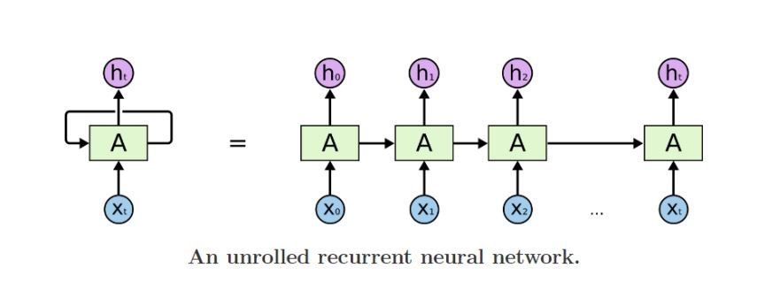

# RNN

- ht-1 : 이전 은닉 상태
- xt : 현재 입력 값
- ht : 현재 은닉 상태
- fW : rnn 함수
- y : rnn output 값

- ht = fW(ht-1,xt)
- ht = tanh(Whhht-1 + Wxhxt)
- yt = Whyht

- yt는 1차원 벡터

# Types of RNNs

- one to one : 일반적인 rnn

- one to many : Image Captioning

- many to one : Sentiment Classification

- many to many : Machine Translation

- many to many : Video classification on frame level

# Character-level Language Model

- word-level, character-levle 둘다 수행 가능.

- 입력 단어가 들어오면 예측 단어를 생성.

- character-level로 단어집합 구성.

- 각 단어를 one-hot vector로 변환.

# BPTT

- 학습 데이터가 길면 GPU로 못 올라감.
- 따라서 잘라서 학습 함.

# Vanishing/Exploding Gradient Problem in RNN

- 은닉 상태가 계속 행렬곱이 되고 backpropagation 될 때도 곱해지므로 기울기가 소실되거나 폭발하게된다.

# LSTM

- 기울기 소실, 폭발이 timestamp가 멀어져도 잘 학습.

- forget gate : cell state와 element 곱을 해서 특정 비율로 정보를 버림.

- gate gate : tanh를 거침. input gate의 값과 곱해져서 새로운 cell state를 만듦.

- output gate : cell state를 tanh를 거치고, 시그모이드를 거친 값과 곱해줌.

- cell state : 기억해야할 모든 정보를 가지고 있음.

- 은닉 상태 : 지금 당장 필요한 정보만 필터링하는 역할.

# GRU

- 은닉상태가 LSTM의 cell state와 같은 역할을 함.
- 새로운 cell state를 만들 때 1-input gate의 값과 input gate의 값의 가중 평균을 사용함.

