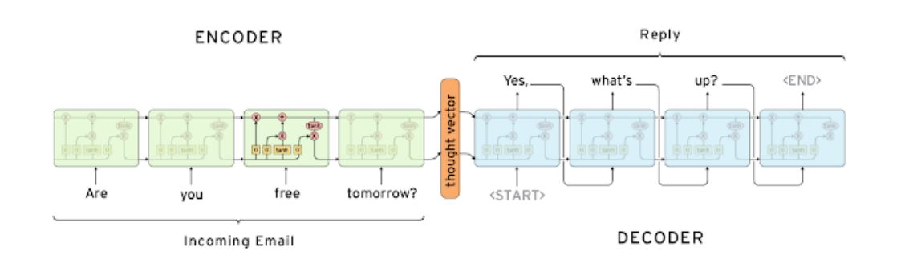
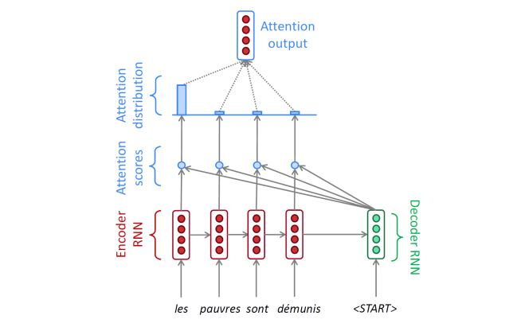

# Seq2Seq

- 단어들의 연속을 input으로 받아 단어들의 연속 output을 만들어냄.

- Encoder와 Decoder로 이루어져있음.

- Encoder와 Decoder는 별개의 파라미터를 사용.

## Seq2Seq 학습

- Decoder의 은닉 상태를 Encoder의 은닉 상태와 내적 연산을 해서 유사도를 구함. (Attention score)
- Softmax를 적용. (Attention distributions)
- 각 Encoder의 은닉 상태와 어텐션 분포를 가중 평균을 냄. (컨텍스트 벡터)
- 컨텍스트 벡터와 Decoder의 은닉 상태와 concatenate 되어 output layer의 입력이 됨.

- 학습을 할 때는 예측된 단어를 input으로 하는 것이 아닌 ground truth를 줌. (Teacher forcing)

- 추론을 할 때는 예측된 단어를 input으로 함.

- 학습을 할 때 Teacher forcing을 섞어서 학습하는 방법도 있음.

## 어텐션 매커니즘

- 벡터 내적을 사용하는 방법.
- 두 벡터 내적 전 새로운 학습가능한 가중치 적용 방법.
- 두 벡터를 concatenate하는 방법.

## 어텐션의 장점

- 기계번역 좋은 성능을 보임.
- bottleneck problem 해결.
- 기울기 소실 문제 해결.
- 해석이 가능함.