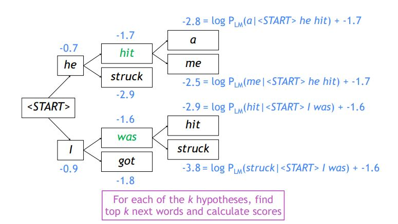
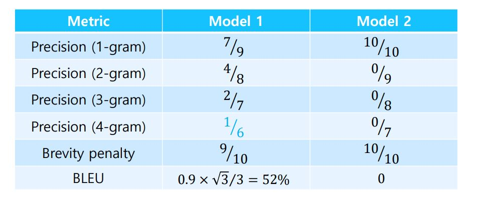

# Greedy decoding

- 가장 좋아보이는 단어를 선택하는 것을 말함.

- 단어를 잘못 예측했을 때 이를 사용해서 뒤 단어를 예측.

- P(y|x)를 최대화 하는 것을 목적으로 함. 이때 y는 출력 문장을 의미함.

- 이때 앞서 나온 단어의 확률값이 엄청 크고 이어서 나오는 단어들의 확률이 작아지는 경우가 있음.

- 모든 단어의 확률 값을 높이는 방법이 있지만 이는 많은 시간복잡도를 요구함.

# Beam search

- k개의 가장 비슷한 문장을 유지함.

- k는 beam size.

- 로그를 취해주면서 식이 변경됨.

- Beam search가 모든 경우의 수를 구하지는 않음.

- 확률 값이 0~1 사이의 값이므로 -값이 나옴.

# BLEU score (생성모델의 품질 평가 척도)

- 단순한 평가 방식은 단어가 다 맞고 순서만 한칸씩 뒤로 밀리면 정확도가 0이 됨.

- Reference : Half of my heart is in Havana ooh na na
- Predicted : Half as my heart is in Obama ooh na
- precision : correct words / length of prediction (7/9)
- recall : correct words / length of reference (7/10)
- f-measure : (precision * recall) / (1/2) * (precision + recall)
- 산술평균 > 기하평균 > 조화평균
- 조화 평균과 기하평균은 작게 위치.
- f-measure는 조화 평균을 택한 방법.
- 정확히 단어들을 맞혀도 순서가 틀리면 맞힌거라고 하지 못함.
- BLEU는 precision만을 고려함.
- BLEU는 기하평균을 사용 함.

- 순서가 틀린 모델은 n-gram으로 확장하니 precision이 0을 가짐.
- 순서가 틀린 모델은 n-gram으로 확장하니 bleu가 0의 값을 갖는 것으로 보임.
- bleu는 어느정도 순서를 고려하는 평가지표임.

