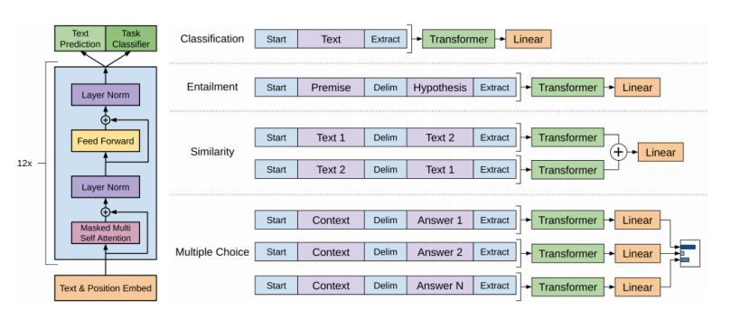

## GPT-1

- S, E와 같은 special tokens를 도입함.
- 추가적인 task-specific한 구조가 필요가 없음.

## BERT

- pretrain된 모델.
- gpt-1은 앞쪽 문맥만 고려.
- MLM을 사용.
- Transformer의 인코더를 사용.
- wordpiece embedding을 사용.
- 학습되는 positional encoding을 사용.
- segment embedding을 사용.

### MLM

- 단어 중 15%를 [MASK]로 치환.
- fine-tuning 할 때 불일치 문제가 생김.
- 15% 중 80%만 [MASK]로 치환을 하고 나머지 10%는 다른 random한 단어로 치환하고 나머지 10%는 바꾸지 않음.

### NSP

- [SEP]를 추가해서 두 문장이 입력이 됨. 두 문장이 연속적인지 아닌지를 예측하는 task.

## BERT VS GPT-1

- training data size : GPT는 BookCorpus, BERT는 Wikipedia 사용.
- BERT는 [SEP], [CLS], sentence A/B embedding 사용.
- Batch size : BERT는 128000 words, GPT는 32000 words 사용.
- Task-specific fine-tuning : GPT-1은 모든 task가 똑같은 learning rate 적용 BERT는 task 마다 다른 learning rate 적용.

