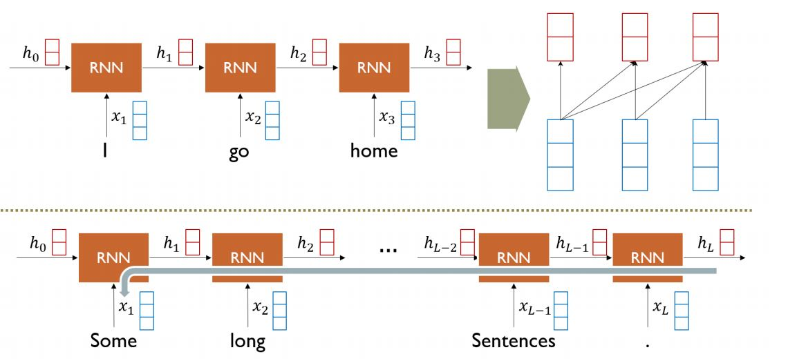

## 트랜스포머가 등장한 이유

- rnn 계열 모델은 long term depedency 문제가 있음.

- 해결 방법으로 양방향 rnn이 등장함.

- forward와 backward의 은닉 상태를 concatenate 함.

- 여전히 long term dependency 문제가 있음.

## Transformer의 등장

- 각 단어마다 Query, Key, Value 벡터들을 만듦.

- 각 단어의 Query 벡터와 Key 벡터간 내적 연산을 통해 유사도를 구함.

- 단어 자신들끼리 유사도를 구하면 가장 높은 유사도가 나오지만 query 벡터와 key 벡터를 나누면서 자신과의 유사도가 가장 높지 않게 됨.

- 각 단어와의 유사도를 softmax를 적용 함. (각 단어마다 적용되는 가중치로 만듦.)

- 가중치를 각 단어의 value 벡터로 적용하고 sum을 해줌.

- 각 단어마다 다른 단어와의 유사도를 구하므로 long term depedency 문제가 일어나지 않음.

- Query, Key 벡터의 차원은 dk로 같은 차원을 가지고 Value 벡터는 dv로 다른 차원을 가져도 됨.

- `A(Q, K, V) = softmax(QKT)V`

- 실제 Transformer 구현 시는 Q, K, V 가 모두 같은 차원을 가짐.

- 어텐션 연산을 할 때 sqrt(dk)로 나누어 줌.

- Q와 K가 연산을 할 때 평균 : 0 분산 : 1을 가정하는 확률 분포로 부터 추출된다고 하면 차원과 같은 분산을 가지게 됨.

- 분산이 커지게 되어 분산을 1로 유지 해주 기 위해 dk 로 나누어 줌.

## Multi-Head Attention

- 동일한 seqeunce가 있을 때 여러 측면으로 부터 정보를 추출하기 위해 여러개를 가짐.

- Self-Attention은 n2 * d의 complexity를 가짐.
- Recurrent는 n * d2의 complexity를 가짐.
- 긴 seqeunce 이면 (n이 길면) transformer가 많은 메모리를 요구함.
- 하지만 학습은 Self-Attention이 더 빠름.

## Transformer's Block

- skip-connection을 사용.
- 층 정규화 사용해서 각 layer의 평균과 분산을 0과 1로 만듦.
- Feed Forward 연산을 사용.

## Positional Encoding

- RNN 계열은 seqeunce 순서대로 입력으로 들어가서 순서 정보가 포함되어 있음.

- Transformer는 행렬 형태로 입력으로 주므로 순서 정보가 없음.

- sin과 cos을 이용한 순서 정보를 사용.

## Warm-up Learning Rate Scheduler

- 기울기가 급할 때는 learning rate를 낮추고 기울기가 완만해지면 learning rate를 높여서 학습을 진행 함.

- minimum 근처로 가면 learning rate를 낮춤.

## Decoder

- 인코더의 output을 K, V decoder의 입력을 Q로 받아서 어텐션 연산을 수행.

- Attention과 Feed Foward를 거치고 linear 연산과 softmax를 적용하고 output 출력.

## Masked Self-Attention

- 디코더는 뒤로 나오는 단어의 정보를 참고하면 안 되므로 뒤로 나오는 단어들을 masking 함.

- 그림을 보면 각 단어 이후 나오는 값들은 masking을 하게 됨.

