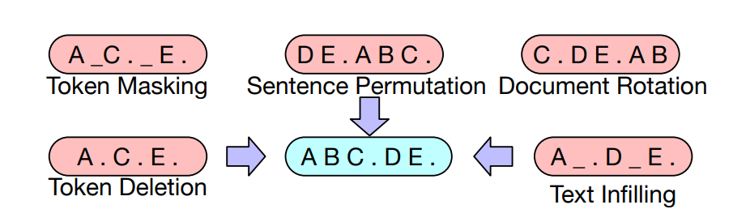

# BART

* Bidirectional과 Auto-Regressive를 모두 결합해 사전학습한다.

## Abstract

* BART는 sequence-to-sequence 모델인 denoising-autoencoder이다.
* 사전학습은 크게 두가지로 나뉘어짐.   
  1. 임의 noising function으로 text를 corrupt 시킨다.
  2. sequence-to-sequence 모델이 원래 text를 복원하면서 학습을 한다.
* BART는 트랜스포머 구조를 사용하는 데 단순하지만 BERT와 GPT의 일반화를 보여준다.   
* 많은 노이즈 기법이 사용되며 무작위로 섞거나 in-filling scheme을 사용한다.

## 1 Introduction

* 사전학습은 크게 두가지로 나뉘어짐.

  1. 임의 noising function으로 text를 corrupt 시킨다.

  2. sequence-to-sequence 모델이 원래 text를 복원하면서 학습을 한다.

* BART는 트랜스포머 구조를 사용하는 데 단순하지만 BERT와 GPT의 일반화를 보여준다.

* 많은 노이즈 기법이 사용되며 무작위로 섞거나 in-filling scheme을 사용한다.   

* 주요 장점은 노이징의 유연성임. 길이 변경을 포함한 임의 변형이 기존 text로 적용 됨.

* BART는 문장 생성 및 이해 task를 fine tuned 할 때 효과적임.

* 기계 번역 task는 추가적인 transformer layers를 추가하며 외국어를 노이즈가 추가된 영어로 번역하면서 학습 됨.

## 2 Model

### 2.1 Architecture

* BART는 손상된 document를 기존 document로 복원하는 denoising autoencoder 모델이다.

* 모델의 구조는 Transformer를 사용하지만 ReLU를 GeLUS로 변경하고 가중치 초기화는 평균 0 분산 0.02인 정규분포로 초기화를 시켰다.

* base 모델은 6개의 layer를 사용하고 large 모델은 12개의 layer를 사용함.

* 구조는 BERT와 비슷하지만 몇 가지는 다름.

  1. 인코더의 마지막 layer와 디코더가 cross-attenton을 수행함.
   (기존 트랜스포머와 같음)
  2. BERT와 달리 feed-forward network가 없음.

* BART는 BERT보다 같은 크기일 떄 10% 더 많은 파라미터를 가지고 있음.

### 2.2 Pre-training BART

* BART는 문서들의 일부를 corrupt하고 디코더의 output과 기존 문서와 크로스엔트로피를 최적화하면서 학습이 됨.

* 기존은 특정 노이징 기법만 사용되는 것과 달리 BART는 문서를 corrupt할 때 어떤 기법이든 적용되도록 함.

 

#### Token Masking
* BERT와 같이 랜덤 token이 추출되고 MASK token으로 대체된다.

#### Token Deletion
* 랜덤 token이 input으로 부터 제거된다. 모델은 어떤 위치가 missing inputs인지 결정해야한다.

#### Text Infilling   
* lambda 3인 포아송 분포로 추출된 길이의 text spans를 샘플링한다. 각 span은 하나의 MASK token으로 대체된다. 0-length spans도 MASK token이 추가된다.

* Text infilling은 SpanBERT의 영향을 받았다. SpanBERT는 다양한 분포로부터 길이를 추출하고 같은 길이의 MASK 토큰으로 각 span을 대체한다.

* Text-infilling은 모델이 span으로부터 얼마나 많은 token이 사라졌는지 예측하면서 학습을 한다.

#### Sentence Permutation
.으로 문서가 문장들로 나눠지고 이 문장들은 무작위 순서로 섞임.

#### Document Rotation
토큰이 무작위로 골라지며 문서는 선택된 토큰으로 시작하도록 회전함. 이 task는 모델이 문서의 시작을 맞추면서 학습함.

## Fine-tuning BART

### 3.1 Sequence Classification Tasks

* 같은 input이 encoder와 decoder로 들어가고 마지막 decoder 토큰의 마지막 hidden state가 linear classifier로 들어감.

* 이는 BERT의 CLS와 같지만 BART는 추가적인 token을 추가함.

### 3.2 Token Classification Tasks

* 인코더와 디코더로 완전한 문서를 입력으로 주며 각 단어의 표현으로써 디코더의 top hidden state를 사용함.
   
* 이 표현은 토큰을 분류하는 데 사용 됨.

### 3.3 Sequence Generation Tasks

* 인코더 input은 input sequence이며 디코더는 outputs을 자동적으로 만들어낸다.

