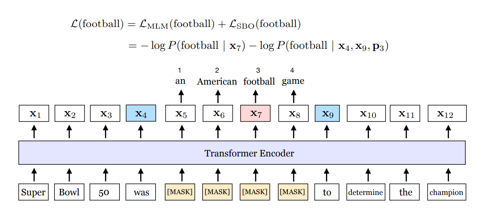
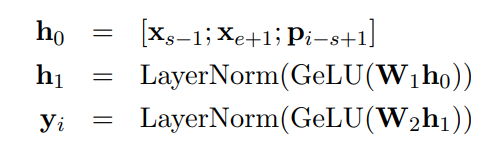
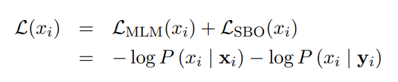
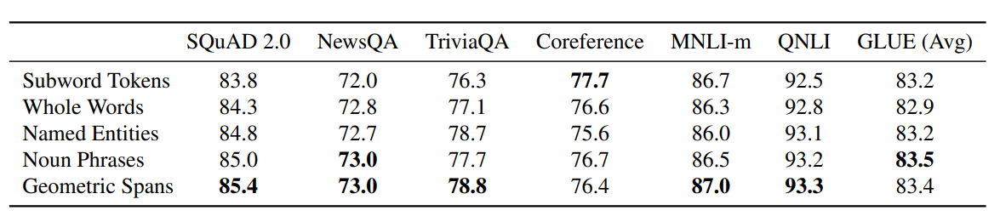
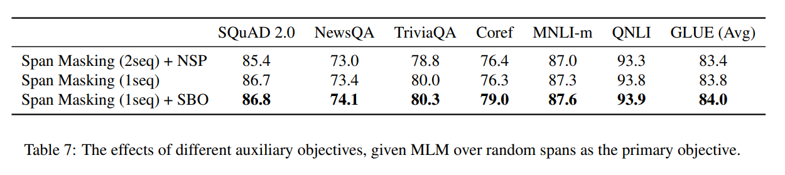

# SpanBERT

* 더 나은 표현과 text의 spans를 예측을 위해 고안된 사전학습 방법인 SpanBERT를 제안한다.

## Abstract

* BERT의 접근법을 확장시킴.   
  -> 1. 랜덤 token들이 아닌 연속된 spans를 마스킹 함.   
  -> 마스킹된 span의 전체 내용을 예측하도록 span의 경계 표현을 학습함.

## 1. Introduction

* SpanBERT는 마스킹 기법과 훈련 목적함수가 BERT와는 다르다.   
  -> 1. 랜덤인 하나의 token들이 아닌 연속된 spans를 무작위로 마스킹 함.   
  -> 새로운 span-boundary objective를 도입함. 모델은 경계에 있는 관측된 token들로 부터 전체 마스킹된 span을 예측하도록 학습함.

* Span-based masking은 모델이 span이 나타나는 문맥을 사용하여 전체 spans를 예측하도록 함. 또한 SBO는 파인튜닝 단계 동안 쉽게 접근되는 경계 tokens로 span-level 정보를 저장하도록 함.(Figure 1 설명)   

* SpanBERT를 구현하기 위해 기존 BERT를 능가하는 잘 학습된 BERT를 만듦.   

* baseline 모델을 만드는 동안 NSP task와 함께 절반길이의 segments 보다 하나의 segments를 사전 학습하는 것이 대부분 downstream tasks의 성능을 높였다.   

* 잘 학습된 single-sequence BERT baseline의 top부분을 수정사항을 추가했다. 

 

 

* a American football game이라는 span이 마스킹 되었음.   

* 마스킹된 token들을 예측하기 위해 x4, x9의 경계 단어들을 사용함.   

* 각 마스킹된 단어들을 예측할 때 MLM과 경계 단어들과 위치 임베딩이 주어졌을 때 마스킹된 토큰을 예측하는 SBO가 더해져서 loss가 구성됨.

## 3. Model

* BERT의 영감을 받았지만 세가지의차이점이 있다.   
  
  -> 1. spans를 마스킹하기 위한 다른 랜덤 절차를 사용함.   

  -> 새로운 SBO를 사용함. span의 경계에 있는 단어들로 span의 모든 단어를 예측함.   
  
  -> 학습 데이터를 위해 하나의 연속된 segment를 추출함. 즉 NSP를 사용하지 않음.

### 3.1 Span Masking

* X = (x1,x2,...,xn) sequence가 주어지면 반복적으로 15%의 마스킹이 다 될 때까지 text의 spans를 반복적으로 추출함.   

* 반복적으로 추출할 때 짧은 spans로 치우쳐진 기하분포로 부터 span length를 추출함.   

* 다음 마스킹 될 시작점을 추출함.   

* 항상 완성된 단어들의 sequence를 추출하며 시작점은 한 단어의 시작이어야 한다.

* BERT와 달리 span의 모든 토큰들은 마스킹되거나 추출된 토큰들로 대체된다.

### 3.2 Span Boundary Objective (SBO)

* 경계의 관측된 토큰들를 사용하면서 마스킹된 span의 토큰을 예측하는 SBO를 도입함.   

* sequence의 각 토큰들의 트랜스포머 인코더의 출력물을 x1,...xn 이라고 함.   

* x_s,...x_e인 마스킹된 토큰들의 span이 주어질 때 target token의 위치 임베딩인 P_i-s+1과 경계 토큰인 x_s-1, x_e+1의 output encodings를 사용하며 span의 토큰 x_i를 표현함.

 

 

* x_i token을 예측하기 위해 y_i의 벡터를 사용하며 MLM과 같은 croos-entropy loss를 사용함.   

* SpanBERT는 x_i 토큰의 SBO와 MLM loss를 더함.

 

 

### 3.3 Single-Sequence Training

* NSP를 위한 X_A, X_B를 구성하는 환경은 NSP없이 하나의 단일 문장으로 학습할 때보다 성능이 좋지 않음.   

* 단일 문장 학습이 NSP를 사용한 bi-sequence보다 성능이 좋은 이유를 더 긴 완전한 문장을 학습하는 것과 관련 없는 context가 MLM으로 더해지는 것 때문이라고 어림짐작함.   

* NSP와 두 segment를 추출하는 절차를 제거하고 두 segment의 합이 512가 되는 것 대신 하나의 segment가 512 토큰들로 구성되도록 연속된 segment를 추출함.

## 4 Experimental Setup (생략)

## 5 Results (생략)

## 6 Ablation Studies

* 언어학적으로 형성된 마스킹 기법과 랜덤으로 마스킹하는 기법을 비교하고자 하며 랜덤으로 마스킹하는 기법이 경쟁력있고 다른 접근법보다 좋다는 것을 발견함.   

* SBO의 영향을 연구하고 BERT의 NSP와 이를 비교함.

### 6.1 Masking Schemes

* 랜덤 마스킹 기법과 언어학적으로 형성된 마스킹 기법을 비교함. 마스킹되는 기법이 다른 5개의 모델을 훈련시킴.   

#### Subword Tokens
* BERT처럼 Wordpiece tokens를 추출함.

#### Whole Words
* 단어들을 랜덤으로 추출하고 그 단어들의 subword tokens를 마스킹함. subtokens의 마스크 수는 대략 15%임.

#### Name Entities
* sequence의 50%는 text의 개체명 인식으로부터 추출하고 나머지 50%는 랜덤으로 전체 단어를 추출함. 전체 마스크되는 subtokens은 15%임.   

* corpus를 spaCy의 개체명 인식을 사용하고 엔티티로 명명된 숫자가 아닌 모든 것을 선택함.

#### Noun Phrases
* sequence의 50%는 noun phrases로부터 추출됨. noun phrases는 spaCy의 constituency parser로 추출됨.

#### Geometric Spans
* 기하분포로부터 랜덤 spans를 추출함. SpanBERT와 같음.

* coreference resolution을 제외하면 spans를 랜덤으로 마스킹하는 것이 다른 전략보다 선호됨.   

* 언어적 마스킹 기법은 종종 랜덤 spans와 경쟁력을 보이지만 성능이 일관적이지 않다.   

* 예를 들어 NewsQA는 Noun Phrases와 랜덤 마스킹이 같은 성능을 보이지만 TriviaQA는 낮은 성능을 보임.   

* coreference resolution은 subword tokens를 마스킹하는 것이 다른 마스킹 기법보다 성능이 높지만 랜덤 span 마스킹과 SBO를 적용하면 성능이 향상됨.

### 6.2 Auxiliary Objectives

* NSP를 사용한 bi-sequence 학습이 단일 sequence 학습보다 다운스트림 task의 성능을 좋지않음.   

* span masking으로 사전학습한 모델도 적용되는지 test하고 SBO를 NSP로 대체하는 것의 효과를 평가함.

* 단일 문장 학습이 성능이 향상됨. span masking만 사용하는 것 보다 SBO를 추가하는 것이 coreference resolution의 성능을 F1 score 2.7% 정도 성능이 향상됨.   

* NSP와 달리 SBO는 역효과를 가지지 않는 것으로 보임.

## 7 Related Work (생략)

* 랜덤으로 토큰들을 마스킹하는 것이 아닌 연속적 spans를 랜덤으로 마스킹하고 span의 각 토큰들의 표현들을 사용하지 않고 masked span의 전체적인 문맥을 예측하기위해 span boundary 표현을 학습하면서 BERT의 연장시킨 span 기반 새로운 사전학습 방법을 제시함.   

* SpanBERT는 다양한 task의 성능이 BERT baselines보다 성능을 앞지르며 특히 span selection tasks의 높은 성능을 달성함.
