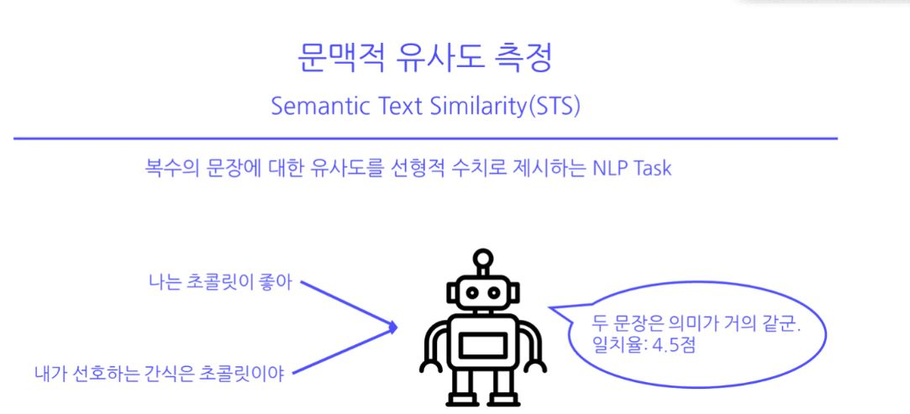

# 부스트 캠프 STS 프로젝트

## 프로젝트 개요

두 문장간 유사도를 선형적 수치로 제시하는 NLP Task의 한 종류인 STS를 진행.
  
## 프로젝트 팀 구성 및 역할

1) 송용우 : 

2) 이강혁 : 

3) 박우빈 : 

4) 안진명 : 

5) 강연철 : 

## 프로젝트 수행 절차 및 방법

### 데이터 탐색 진행  

1. 데이터 결측치가 있는가? -> 결측치는 존재하지 않음.

2. 두 문장의 길이가 어떠한가? -> 최대 문장 길이가 약 80으로 Bert 계열 모델의 최대 토큰 길이인 512를 넘지 않음. -> 긴 문장을 제거하는 것이 나을까?

3. label의 분포는 어떠한가? -> 0~5 사이 값을 가지는 실수 label이 분포하고 있음. label이 0인 데이터가 많음. 데이터 불균형 문제를 생각해보자.  

4. 문장들의 품질은 어떠한가? -> 문장이 slack, petition, nsmc의 데이터 중 일부임. 그대로 sampled 해서 가져온 문장도 있지만 backtrans 시킨 데이터도 있음. nsmc나 slack 문장은 문법적으로 틀린 문장이 많음.

### 데이터 전처리 진행  

1. tokenizing을 시키면 Roberta 모델은 약 700개 Electra 모델은 약 300개 정도의 <UNK> token 발생. <UNK> token 분석해서 필요한 단어를 단어사전으로 추가.

2. 문장을 보면 <UNK> 발생 이유 중 가장 큰 것은 욬ㅋㅋ과 같은 문장이 많음. soynlp 라이브러리를 통해 욬ㅋㅋ를 요ㅋㅋ로 변환.

3. 이모지가 있거나 -_-와 이모티콘이 많음. 없어도 될 것으로 판단 해 정규표현식을 사용해서 제거.

4. ㅋㅋㅋ과 ㅎㅎㅎ가 다른 글씨체로 작성되어 있어서 모두 기존 글씨체로 변환.

### 데이터 모델링 진행

1. BERT 계열 모델을 사용해서 모델링 진행.(Electra, Roberta, Sbert)

2. gradient accumulation을 통해 작은 batch_size의 단점 보완. -> 성능 개선은 X

3. linear warmup learning rate scheduler 사용. -> 총 step의 0.1% 까지 2e-5의 학습률을 도달하고 계속 낮아지도록 해서 학습을 최적화 하려고 함.

4. wandb를 통한 학습 진행 상황 실시간 공유

5. 데이터를 source로 나누어 source 마다 모델링 진행.

### 데이터 모델링 결과 분석

1. valid data로 검증 결과 피어슨 상관계수 91~92의 성능을 보임.

2. 산점도를 통해 모델의 취약점 분석 -> source가 backtrans를 거쳐진 데이터의 피어슨 상관계수가 77~78을 보임.

3. backtrans 데이터 성능을 올리기 위해 backtrans를 통해 데이터 증강 -> 성능 변화 미미

4. 특히 backtrans의 source를 가지는 데이터는 3~5의 label이 많이 있음. -> backtrans를 통해 0~2의 데이터 증강. -> 성능 변화 미미

### 프로젝트 수행 결과

1. backtrans한 데이터만 사용해서 검증 데이터와 비교 -> 75~77의 피어슨 상관계수를 보임. 전체 데이터를 사용해서 학습했을 때 77의 피어슨 상관계수를 보임.

2. 모델별로 예측하는 label 분포가 조금씩 다름 -> 앙상블을 통해 모델을 보완해보자.

3. blending을 사용해 각 모델의 성능과 비례한 비율을 적용함.

4. 기존 모델 SOTA는 91점대 피어슨 상관계수 blending을 활용했을 때 92점대 피어슨 상관계수를 보임.

# 개인 회고

### 나는 내 학습목표를 달성하기 위해 무엇을 어떻게 했는가?

- 학습 목표를 달성하기 위해 NLP 기초대회 강의를 듣고 실습을 진행하며 처음 사용했던 pytorch-lightning을 익숙해지려고 함.

- STS task와 비슷한 klue 논문과 자료를 찾아보고 어떤 방향으로 fine-tuning을 시키면 좋을지 고민을 함.

### 나는 어떤 방식으로 모델을 개선했는가?

- Electra, Roberta, SBERT 세 가지의 모델을 사용함.

- papers with code를 참고하면 STS task의 SOTA 모델은 Roberta 이므로 먼저 Roberta로 접근을 함. 기본 baseline 코드를 사용했을 때 87~88의 피어슨 상관계수를 보임.

- 데이터 탐색을 하고 데이터를 전처리 함. 이모지 제거, 이모티콘 제거, ㅋ,ㅎ 다른 글꼴 대체, @#$%^&*_-와 같은 불필요 글자 제거, 욬ㅋㅋ과 같은 문장 요ㅋㅋ로 대체.

- 두 문장간 유사도를 구할 때 문장 임베딩을 활용하면 더욱 좋은 성능을 내지 않을까 생각을 함.  
  -> SBERT 사용. SBERT를 통해 label을 5.0으로 나눠 loss 함수를 코사인 함수로 바꿔 사용.  
  -> 89정도의 성능을 보이지만 검증 데이터를 사용해 산점도를 그렸을 때 편차가 큰 것으로 확인.

- linear warmup learning rate scheduler 대신 cosine 주기 learning rate scheduler 사용.  
  -> 어느 정도 local minimum으로 수렴했을 때 학습률을 높여서 빠르게 지나가는 것을 목표로 함.
  -> 오히려 학습률이 높아지면 loss값이 상승.

- 모델 간 특정 label을 잘 맞추는 경향이 있을 것이라고 생각 함.
  -> 검증 데이터와 검증 데이터를 예측한 값을 산점도를 그려 모델의 예측 분포 비교를 함.
  -> blending을 통해 모델의 성능 향상.

### 내가 한 행동의 결과로 어떤 지점을 달성하고, 어떠한 깨달음을 얻었는가?

1. 전처리를 하는 것이 모델의 성능을 향상 시킴.

2. 모델을 돌렸을 때 체크포인트 등 모델을 저장하는 것이 중요함.  
  -> 저장 안 해놓으면 다시 돌려야함.

3. 팀 프로젝트를 진행할 때 convention 등이 중요한 것 같음.

4. bleding을 통해 여러 모델을 사용하면 성능이 향상됨.

5. 학습을 시킬 때 메모리를 관리하는 것이 중요함.

### 전과 비교해서, 내가 새롭게 시도한 변화는 무엇이고, 어떤 효과가 있었는가?

1. 파이토치가 아닌 파이토치 라이트닝을 사용.  
  -> 파이토치보다 코드가 간결해짐.  
  -> early stopping을 직접 구현하지 않아도 됨.
  -> train, valid, test 과정이 나뉘어져 있어 적용하는 것이 편리함.

2. SBERT를 사용.  
  -> transformers 라이브러리와 sentence-transformers 라이브러리를 사용하게 됨.  
  -> SBERT 구조를 이해하고 BERT와의 차이점을 알게 됨.

3. 코드를 py 파일로 작성해서 terminal로 학습을 진행.

4. 서버를 활용해서 서버를 연결함.

5. 이진 분류로 파인튜닝을 하고 회귀 문제로 다시 파인튜닝 시도.  
  -> 분류 task 성능이 좋지 않음. (정확도가 60%를 못 넘음.)

