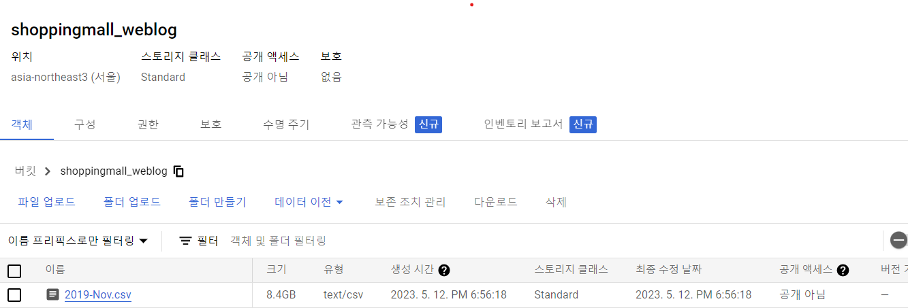
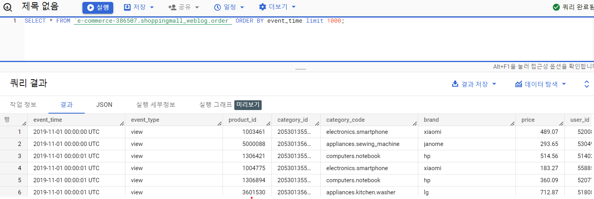

## 구글 클라우드 플랫폼 사용 이유

쇼핑몰 웹 로그 데이터는 8.4GB 용량을 가지고 있으며, 행의 개수는 대략 6000만 개입니다. 일반적인 RDBMS 종류를 사용하면 데이터를 테이블로 만드는 데 많은 시간이 걸리게 됩니다.   

저는 MYSQL을 사용해서 데이터 업로드 시도를 했지만, VSCODE 자체가 튕기는 현상이 일어나서 구글 클라우드 사용을 고려했습니다.   

단순히 빅쿼리를 사용하려고 했지만, 빅쿼리가 무료로 업로드 할 수 있는 데이터 용량 크기가 정해져 있었고 이를 한참 넘어 구글 클라우드 스토리지 사용을 불가피하게 결정하게 되었습니다.   

원래는 유료지만, 아직 무료판을 체험하지 않아서!! 무료로 사용할 수 있었습니다.

## 버킷 생성

구글 클라우드 스토리지를 사용하려면 먼저 버킷을 생성해야 합니다.

버킷을 생성할 때 위치를 가까운 곳으로 해야 비용이 조금만 나간다고 합니다.

버킷을 생성하면 아래와 같이 생성한 버킷을 관리할 수 있는 페이지가 나오게 됩니다. 여기서 원하는 데이터를 업로드 해주면 끝!!

## 구글 빅쿼리 연동

구글 클라우드를 사용하면 구글 클라우드 스토리지, 빅쿼리, 구글 애널리틱스, looker studio 등 데이터 분석과 관련된 제품을 쉽게 연동할 수 있어서 좋습니다.   

구글 스토리지로부터 데이터를 불러오고 설정할 때 자동으로 스키마 생성을 체크 해 주면 아래와 같이 알아서 테이블을 만들어 줍니다.

쿼리를 작성해서 데이터가 잘 들어왔나 확인 해 보겠습니다.   
SELECT 문을 작성하니 데이터가 잘들어온 것으로 보입니다.

